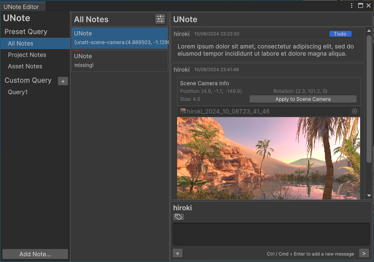
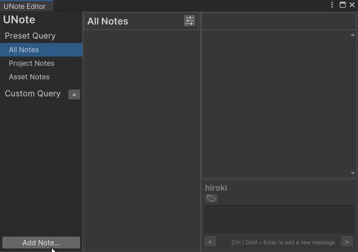

<h1 align="center">UNote</h1>

[日本語ドキュメント (Japanese Documents)](README_JA.md)

UNote is a tool for creating and editing notes in Unity. Notes can include additional information like object references and images, and multiple users can write on a single note.

<h2>Features</h2>

* <b>Note Editor</b>: Add, delete, and edit notes
* <b>Inspector Editing</b>: Notes linked to assets can also be edited from the Inspector
* <b>Note Properties</b>: Categorize by tags, prioritize with favorites, and restrict editing or display with archive options
* <b>Embedding Additional Information</b>: Add information such as asset references to notes
* <b>Screenshots</b>: Take screenshots and embed them as additional information; edit them with a simple image editor
* <b>Search</b>: Filter and sort by text content or note properties; search conditions are user-defined

For an overview of planned features, please refer to [TODO.md](Doc/En/TODO.md).

<h2>Installation</h2>

Requirement
Unity 2022.3 and later

1. Go to Window > Package Manager from the menu
2. Click the + button and select Add package from git URL...
3. Enter `https://github.com/gok11/UNote.git?path=/Assets/UNote` and click Add

<h2>Quick Start</h2>

<h3>Setting the Username</h3>

First, set your username. This affects note editing permissions, so avoid duplicates when multiple users are involved, and be cautious not to change the initial name.

By default, the PC’s username is set.

1. Go to Edit > Preferences... from the menu
2. Set UNote > Editor Name to your desired name

<h3>Adding Project Notes and Messages</h3>

1. Select UNote > Note Editor from the menu bar
2. Open the note addition window from the Add Note... button in the bottom left
3. Set the note type to Project and select Add New Note
4. Change the note name from the top of the right pane
5. Enter text into the input field on the right pane and add a message by pressing the > button or using a shortcut

You can edit your added note names and messages later.

<h3>Adding Asset Notes</h3>

1. Select the asset where you want to add a note
2. Add a message from the input field

You can also add notes from the Note Editor, as with project notes, but it's recommended to add them directly from the Inspector for fewer steps.

<h3>Screenshots</h3>

Select + button > Screenshot > GameView in the input field on the right pane to take a screenshot, which will add reference information to the input field.

After sending the message, hover over the displayed image and press the button to perform simple edits.

<h3>Setting Additional Information</h3>

Select any tag by clicking the tag icon in the input field to add it to the message.

To add reference information to a message, drop the target asset into the input field.

<h3>Search</h3>

You can define a query to display only the notes that match its contents.

Click the button to the right of Custom Query to add a query.

You can specify the following for the query:

* Search Term: Checks if the note name or message contains this string
* Note Type: Matches the note type
* Note Tag: Checks if any messages linked to the note contain the tag; None displays notes where all messages lack tags
* Note Sort: Sort by either updated or created date, in ascending/descending order
* Display Archived: Choose whether to show archived notes

To save the current query, select Save.

<h2>License</h2>

MIT ([LICENSE](LICENSE))
