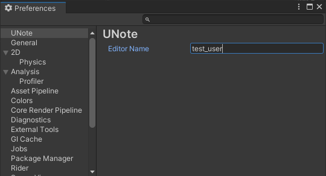

<h1 align="center">UNote</h1>

[English Documents(英語ドキュメント)](README.md)

UNote は Unity 上でメモを作成・編集する機能を提供し、1つのメモに対して複数ユーザーからコメントする機能を提供するツールです。

<h2>機能</h2>

* メモエディターからメモの追加/削除/編集を行えます
* プロジェクト全体に関するメモ、特定のアセットに対するメモを作成できます
* アセットメモは対象のアセットを選択した場合に Inspector からも編集できます
* メモをお気に入り登録し、優先表示するようにできます
* メモをアーカイブし編集や表示を制限できます
* 検索機能によってテキスト内容でフィルタリングしたり、表示順を作成順などにソートできます

追加予定の機能の概要については [TODO.md](Doc/Ja/TODO.md) を確認してください。

<h2>インストール</h2>

Unity2022.3 以降で動作します。

1. メニューから Window > Package Manager を選択
2. \+ ボタンを押して Add package from git URL... を選択
3. `https://github.com/gok11/UNote.git?path=/Assets/UNote` を入力して Add を押す

<h2>クイックスタート</h2>

<h3>ユーザー名の設定</h3>

他ユーザーに見せる名前を設定します。メモの編集権限にも影響するため最初に付けた名前は変更しないよう注意してください。

1. メニューの Edit > Preferences... を選択
2. UNote > Editor Name を任意の名前に設定

<h3>プロジェクトメモとコメントの追加</h3>

1. メニューバーから UNote > Note Editor を選択
2. 左下の Add Note... からメモ追加ウィンドウを表示
3. メモの種類を Project にして Add New Note
4. 右ペインの上部からメモ名を変更
5. 右ペインのコメント入力フィールドにテキストを入力、 > ボタンかショートカットからコメントを追加

自分で追加したメモ名やコメントは後から編集できます。

<h3>アセットメモの追加</h3>

1. メモを追加したいアセットを選択
2. メモ記入用のフィールドからコメントを追加

プロジェクトメモ同様 Note Editor から追加することもできます。 
Inspector から追加する方が手順が少ないためオススメです。

<h2>ライセンス</h2>

MIT ([LICENSE](LICENSE))
